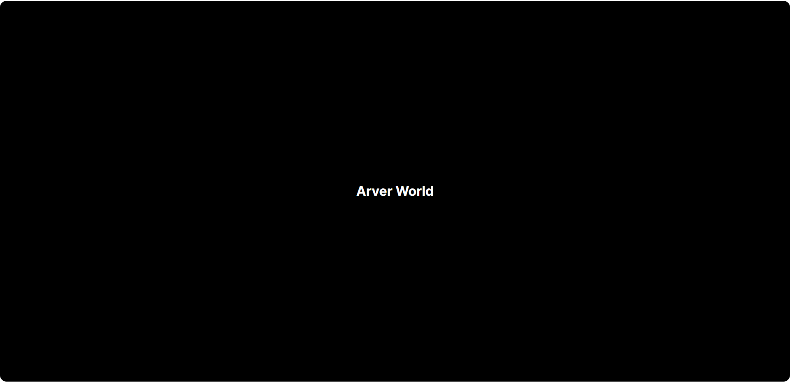

<a name="readme-top"></a>

# Arver world

<br />
<div align="center">
  <a href="https://github.com/ArverWorld/arver-world">
    
  </a>

  <h3 align="center">Arver world</h3>

  <p align="center">
    A chill place about arousing topics
    <br />
    <a href="https://github.com/ArverWorld/arver-world"><strong>Explore the docs »</strong></a>
    <br />
    <br />
    <a href="https://github.com/ArverWorld/arver-world">View Demo</a>
    ·
    <a href="https://github.com/ArverWorld/arver-world/issues">Report Bug</a>
    ·
    <a href="https://github.com/ArverWorld/arver-world/issues">Request Feature</a>
  </p>
</div>

<details>
  <summary>Table of Contents</summary>
  <ol>
    <li>
      <a href="#about-the-project">About The Project</a>
    </li>
    <li>
      <a href="#libraries-and-technologies">Libraries and technologies</a>
      <ul>
        <li><a href="#techs">Techs</a></li>
        <li><a href="#languages">Languages</a></li>
        <li><a href="#ide">IDE</a></li>
      </ul>
    </li>
    <li>
      <a href="#usage">Usage</a>
    </li>
    <li>
      <a href="#contact">Contact</a>
    </li>
  </ol>
</details>

## About the project

<p align="center">
  
</p>

This app is in its early stages. Here is a preview of what it looks like (it is updated with every patch).

This idea of this app is to gather all topics that I'm passionate about in one place, and to learn more about modern web technologies (in 2023 😜). It may be a little project that stays relatively simple or become something bigger where people can come to share what they love on it...

<p align="right"><a href="#readme-top">⬆ back to top</a></p>

## Libraries and technologies

### Techs

- [Next.js](https://nextjs.org/)
- [React](https://fr.reactjs.org/)
- [ESLint](https://eslint.org/)

### Languages

- [Typescript](https://www.typescriptlang.org/)

### IDE

- [Visual Studio Code](https://code.visualstudio.com/)

<p align="right"><a href="#readme-top">⬆ back to top</a></p>

## Usage

Run the development server:

```bash
npm run dev
# or
yarn dev
# or
pnpm dev
```

Open [http://localhost:3000](http://localhost:3000) with your browser to see the result.\
[API routes](https://nextjs.org/docs/api-routes/introduction) can be accessed on [http://localhost:3000/api/hello](http://localhost:3000/api/hello).

<p align="right"><a href="#readme-top">⬆ back to top</a></p>

## Contact

[@KorenArver](https://twitter.com/KorenArver) - koren.arver@gmail.com

<p align="right"><a href="#readme-top">⬆ back to top</a></p>
